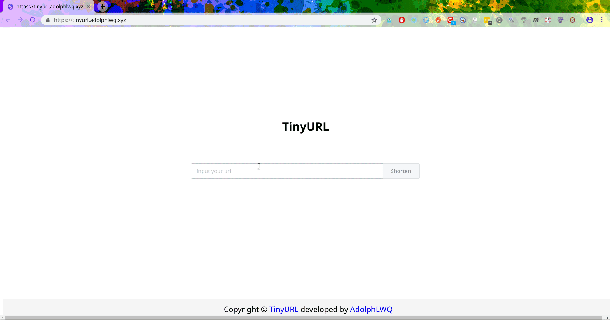

# TinyURL

[](https://travis-ci.org/adolphlwq/tinyurl)  [](https://goreportcard.com/report/github.com/adolphlwq/tinyurl)  [](https://godoc.org/github.com/adolphlwq/tinyurl)

<p align="center">
  <a href="https://tinyurl.adolphlwq.xyz" target="_blank">
    
    <br>
    Live Demo
  </a>
</p>

<p align="center">a url shorten web service written by Golang, Vue and Gin.</p>

## Requisites
- Golang(1.8+)
- [Govendor](https://github.com/kardianos/govendor)
- MySQL/Sqlite3
- make

## Quick Start
1. clone project to **GOPATH**
```
git clone https://github.com/adolphlwq/tinyurl.git $GOPATH/src/github.com/adolphlwq/tinyurl
```
2. sync golang packages
```
govendor sync
```
3. build binary
```
make
```
4. change config in defult.properties
```
# tinyurl dev config
#app
app.host=0.0.0.0
app.port=8877
app.domain=0.0.0.0:8877

# db config
db.type=sqlite3
db.path=.
db.host=
db.port=
db.name=tinyurldb
db.user=
db.password=
```
5. run binary
```
./tinyurl -config defult.properties
```
6. open index.html in `frontend/` with broswer

## TODOs
- [X] validate input url format
- [X] improve random generate string algorithm
    - [X] use math/rand.Read instead math/rand.Intn func
- [X] use logrus replace golang log lib
- [X] reserch [wrk](https://github.com/wg/wrk)
- [X] add test case
- [ ] dynamic adjust short path length (default is 4)
- [ ] count each url parse time (high concurrent situation)
- [ ] qrcode support
- [ ] list api

## Reference
- [GitHub/Ourls](https://github.com/takashiki/Ourls)
- [GitHub/uriuni](https://github.com/dchest/uniuri)
